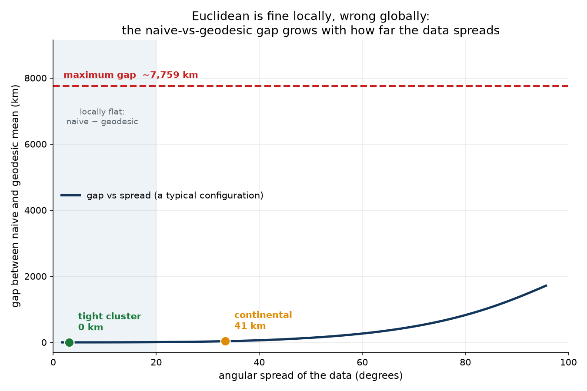
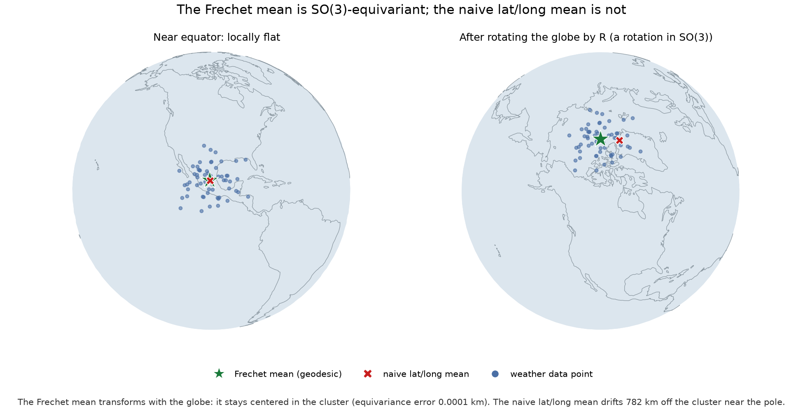
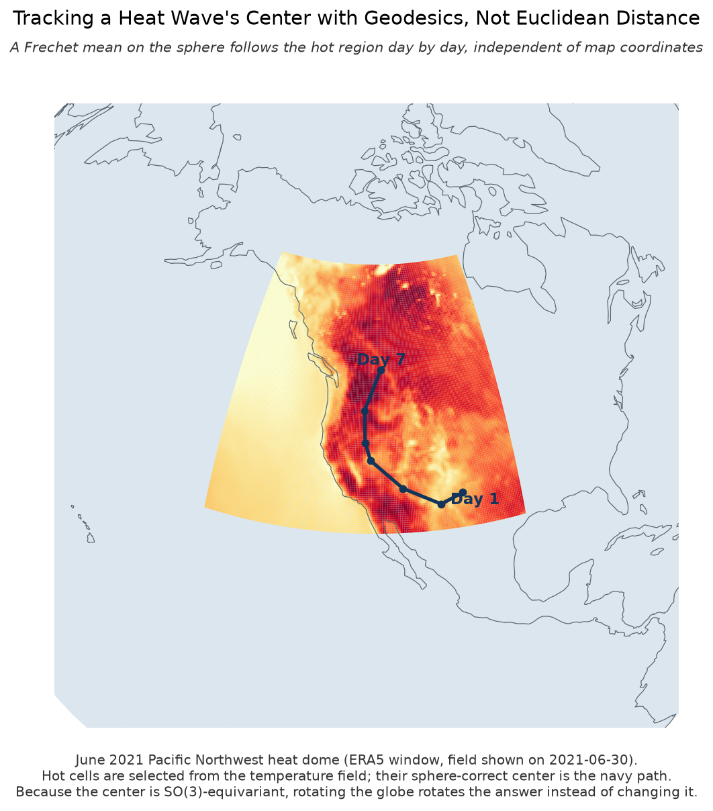
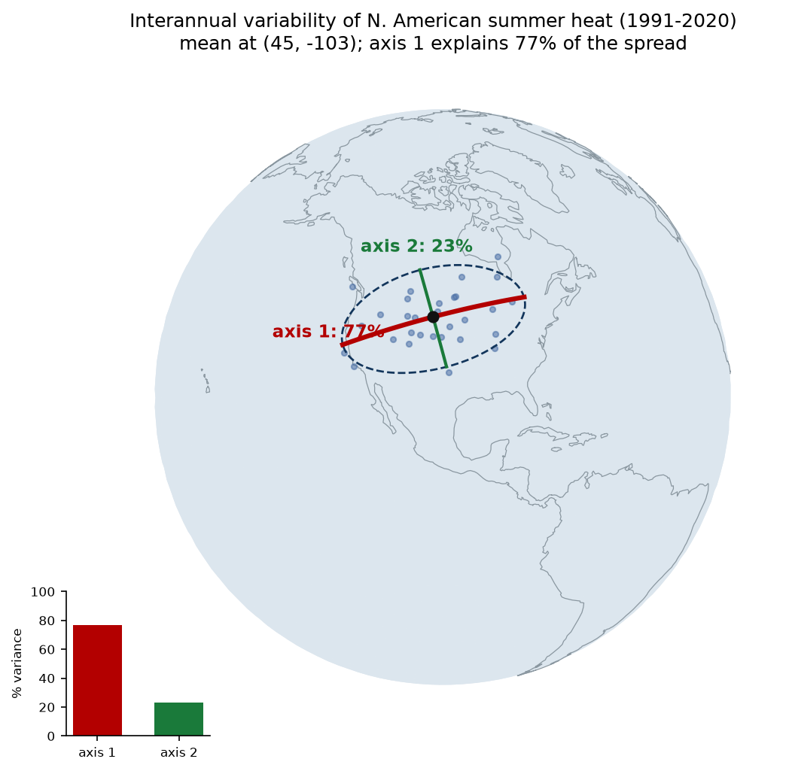

# Weather Data Lives on a Sphere. Our Statistics Should Too.

*Using geometry and group symmetry to track heat patterns on Earth.*

Beyond Euclid gives us the right mathematical structure for weather data on Earth: scalar
fields over the sphere $S^2$, rotation symmetries via the group $SO(3)$, and geometric
statistics that respect both. This article puts that structure to work. We take real ERA5
temperature data, track the center of a heat wave and the year-to-year variability of summer
heat, and show, with reproducible numbers, where flat "just use latitude and longitude"
shortcuts break and where geometry fixes them.

Everything here is a faithful application of known geometric-statistics methods (Frechet
means, tangent-space PCA, Principal Geodesic Analysis), computed with
[GeomStats](https://geomstats.github.io/). No new theory is claimed. The contribution is a
clean, tested bridge from the taxonomy in Papillon, Sanborn, Mathe et al., *Beyond Euclid: an
illustrated guide to modern machine learning with geometric, topological, and algebraic
structures* (Mach. Learn.: Sci. Technol. 6 031002, 2025), to a weather-data workflow.

---

## TL;DR

- A weather snapshot is a scalar field on the sphere: temperature as a function
  $x: S^2 \to \mathbb{R}$, values on the real line, locations on a curved domain.
- Averaging locations by latitude and longitude is a flat shortcut. It can be off by a few
  meters (fine) or by 17,805 km (a point on the wrong side of the planet) depending on where
  the data sits.
- The Frechet mean on $S^2$ is the coordinate-free fix. Because it respects rotations of the
  globe, it has no bad behavior at the poles or the date line.
- On real ERA5 data, the June 2021 Pacific Northwest heat dome's center migrated **2,635 km**
  north over seven days, and the 1991 to 2020 summer heat-anomaly centers vary mainly along a
  single geodesic axis that explains **77%** of the interannual variance.

---

## 1. The data model: weather is a signal on a manifold

Start with what a weather field actually is. A single snapshot of surface temperature assigns
one number, degrees, to every location on Earth. Locations live on the sphere; temperatures
live on the real line. So the object is a function

$$ x : S^2 \to \mathbb{R}. $$

Papillon, Sanborn, Mathe and colleagues give a name to objects like this, a Euclidean-valued
signal over a manifold domain (Card S6 in their taxonomy), and their illustration of it is,
as it happens, this very temperature-on-a-sphere example from Atmo. The naming earns its keep
by isolating what matters: the values are ordinary numbers, but the domain is curved, so any
statistic that summarizes *where* something happens has to respect that curvature.

A second structure hides in plain sight. Where we put longitude zero, and how we orient the
globe in space, is arbitrary. Physically rotating the sphere should rotate our description of
the field without changing the field's meaning, which is another way of saying the rotation
group $SO(3)$ acts on the domain. The paper carries the same temperature example with this
rotation action as Card S9, and much of what follows is about building statistics that behave
correctly under that action.

Those are two of the paper's three organizing lenses, geometry and algebra. The third,
topology, is not needed here, so we leave it out rather than force it.

## 2. The minimal geometry we need

Only a few objects are required. The sphere is the unit sphere in three dimensions,

$$ S^2 = \{\, p \in \mathbb{R}^3 : \lVert p \rVert = 1 \,\}. $$

It is a two-dimensional surface: two numbers, such as latitude and longitude, pin any point,
even though we write points as three-dimensional unit vectors. The one constraint
$\lVert p \rVert = 1$ removes the third degree of freedom.

Distance on the sphere is measured **along the surface**, not through the interior. The
great-circle, or geodesic, distance between two points is

$$ d(p, q) = \arccos\langle p, q \rangle. $$

The center of a set of points is the **weighted Frechet mean**, the point that minimizes the
sum of squared geodesic distances to the data:

$$ \mu = \arg\min_{p \in S^2} \sum_i w_i \, d(p, p_i)^2 . $$

There is no closed form. It is found by iteration using the exponential and logarithm maps of
the sphere: the log map $\log_\mu$ sends sphere points into the flat tangent plane at $\mu$,
and the exp map $\exp_\mu$ sends tangent vectors back onto the sphere. One Karcher step
averages the data in the tangent plane and moves the estimate along the surface:

$$ v = \frac{\sum_i w_i \log_\mu(p_i)}{\sum_i w_i}, \qquad \mu \leftarrow \exp_\mu(v), $$

repeated until $\lVert v \rVert \to 0$. By construction the Frechet mean stays on the
manifold, where the ordinary Euclidean average would fall off it, and that contrast is exactly
why it is the right notion of center on a curved space (Figure 6 of the paper illustrates
precisely this). The same log and exp maps are what later make tangent-space PCA meaningful.

## 3. Geometry proof: Euclidean shortcuts fail when the sphere matters

The naive alternative to the Frechet mean averages the raw three-dimensional vectors and
renormalizes back onto the sphere:

$$ \mu_{\text{chord}} = \frac{\sum_i w_i p_i}{\lVert \sum_i w_i p_i \rVert}
   \qquad \text{versus} \qquad
   \mu_{\text{geo}} = \arg\min_{p \in S^2} \sum_i w_i \, d(p, p_i)^2 . $$

The chordal mean minimizes straight-line distance through the interior of the ball, not
distance along the surface. For a small patch these agree, because a small piece of a sphere
is nearly flat. As the data spreads, the chord increasingly short-cuts through the interior
and the two answers pull apart.



The figure sweeps a fixed shape from a tiny patch to nearly hemispheric and plots the gap
between the two means. The dashed line is not a point on the curve: it marks the worst
realistic case, a near-antipodal global configuration, whose gap sits far above the typical
trend. Three real reference cases anchor the picture:

| data spread | angular size | gap between naive and geodesic mean |
| --- | --- | --- |
| tight cluster (three Texas cities) | about 3 degrees | 0.0 km |
| continental (New York, London, Reykjavik, Lisbon) | about 33 degrees | 40.7 km |
| global spread (near-antipodal) | about 94 degrees | 7,758.9 km |

There is a sharper failure at coordinate seams. If a cluster straddles the plus or minus 180
degree date line, averaging longitudes in degrees gives roughly zero, placing the "center" on
the opposite side of the planet. In our benchmark that naive latitude-longitude center lands
**17,805 km** away from the true Frechet center.

One honest nuance: for a compact, mid-latitude weather feature the gap can be small, tens of
kilometers or less. That does not weaken the method. It tells us precisely when the flat
approximation is locally adequate and when it is not. The geometry matters in proportion to
how much of the globe the data spans, and it matters absolutely at seams and poles.

## 4. Algebra proof: the answer should rotate with the globe

The reason the Frechet mean has no bad points on the sphere is symmetry. If we rotate the
data by a rotation $R \in SO(3)$, a coordinate-free center must rotate by the same $R$:

$$ \mu(\{R p_i\}) = R \, \mu(\{p_i\}). $$

This is equivariance under the group action, the algebra lens made concrete. The group is
$SO(3)$ rotating the sphere, and a statistic that satisfies this equation depends only on the
data on the sphere, not on how we painted latitude and longitude onto it.



The figure spins a cluster from mid-latitude, where the sphere is locally flat and naive
averaging happens to work, up to the pole. Two things happen. The Frechet mean transforms
with the globe: recomputing it after the rotation gives the same point as rotating the
original mean, with an equivariance error of **0.0001 km**. The naive latitude-longitude mean
does not: it drifts **782 km** off the cluster once the rotation carries it near the pole,
because latitude and longitude are a coordinate frame that distorts there.

The message is not that group theory is elegant. It is that a good statistic respects the
symmetries of the physical domain, and that respect is exactly why it stays correct
everywhere. The daily centers we extract later are themselves just points on the sphere, and
changing the longitude origin is one of these rotations acting on them, so the same
equivariance protects the whole pipeline.

> ### Validation: does the math actually check out?
>
> Real weather has no known true center, so correctness is checked on synthetic data with a
> planted answer, reported here as numbers, not figures.
>
> **Frechet mean (tracking).**
> - Analytic von Mises-Fisher center recovered with **0.00 km** error.
> - Our from-definition Karcher implementation agrees with GeomStats to
>   $1.90 \times 10^{-4}$ km (about 0.19 m), after tightening GeomStats' optimizer, whose
>   default stops about 2.7 km short. The from-definition version exposed that
>   under-convergence.
> - First-order optimality residual $\lVert \sum_i w_i \log_\mu(p_i) \rVert = 5.99 \times
>   10^{-16}$.
> - Planted ten-day trajectory recovered with max error **0.00 km**.
>
> **Principal Geodesic Analysis (variability).**
> - Planted principal axis recovered to within **0.73 degrees**.
> - Our from-definition tangent PCA matches GeomStats TangentPCA, axis difference 0.00
>   degrees.
> - Near a pole, PGA recovers the axis to **0.8 degrees** while naive latitude-longitude PCA
>   is off by **39.2 degrees**.
> - One geodesic axis reconstructs a cloud spread over 53 degrees with **306 km** RMS error.

## 5. Application 1: tracking a real heat wave

Now the real data. We track the center of the June 2021 Pacific Northwest heat dome, one of
the most extreme heat events on record, using ERA5 2 m temperature over a North America window
for June 24 to 30, 2021. Each day:

1. threshold the hottest region from the temperature field (this classifies which locations
   are hot);
2. weight each hot cell by its excess heat and by the spherical area element $\cos(\text{lat})$,
   which corrects for the fact that a latitude-longitude grid over-samples the poles;
3. compute the Frechet mean of those locations on $S^2$ (this locates the center);
4. connect the daily centers with geodesic arcs.



*The rectangular patch is the ERA5 analysis window we requested, not a rendering artifact;
colors are normalized within the window for display.*

The recovered center starts over the US Southwest and marches north to the US-Canada border by
June 30, matching the real event, which culminated in record heat in British Columbia. The
total Frechet-mean migration is **2,635 km over seven days**.

Honest reading: this is a descriptive tracker, not a forecast model, and this particular event
is regional and mid-latitude, so the day-to-day naive-versus-Frechet gap is only 13 to 35 km.
The value is not a dramatic gap on this one event. It is that the same method stays valid
without modification at the seams, poles, and global spreads where the naive tracker fails
outright.

## 6. Application 2: interannual variability with PGA

The second application asks a variability question: from summer to summer, where does North
America run unusually hot, and is there a dominant direction to how that center moves?

For each summer from 1991 to 2020 we take the ERA5 June-July-August mean temperature, subtract
the 30-year climatology to get that summer's anomaly, find the center of the anomalously hot
region with the Tool 1 procedure above, and collect the 30 yearly centers as points on $S^2$.
We use the anomaly rather than absolute temperature on purpose: absolute summer heat always
centers on the Southwest deserts, so its center barely moves, while the anomaly captures the
real year-to-year signal.

Then we run Principal Geodesic Analysis, which is simply PCA done the right way on a curved
space (the paper's Figure 8 places these tangent-space methods within the wider family of
manifold latent embeddings): take the Frechet mean of the 30 centers, map every center into
the tangent plane at that mean with the log map, and run ordinary PCA there. The tangent
covariance is

$$ C = \frac{1}{N} \sum_i u_i u_i^\top, \qquad u_i = \log_\mu(p_i), $$

its eigenvectors are the principal geodesic directions, and the explained-variance ratios are
$r_k = \lambda_k / \sum_j \lambda_j$.



The result is a clean, coordinate-free summary of interannual variability:

- mean center of anomalous summer heat: $44.8^\circ$ N, $102.5^\circ$ W;
- the first geodesic axis explains **77%** of the variance and runs roughly east-west;
- the second axis explains 23%;
- the plus-or-minus two-sigma span of the first axis is about **3,894 km**.

In plain terms, the region that runs unusually hot in a given summer shifts mostly east or
west, far more than north or south. This is a descriptive, not causal, result, and 30 summers
is a small sample, but it is a clean methodological example of doing PCA correctly on a curved
domain: naive latitude-longitude PCA would distort the axis, badly so at high latitude, as the
validation box showed.

## 7. What this contributes, and what it does not

None of the mathematics here is new. What the article does is take the vocabulary of the
Beyond Euclid framework and put it to work on real data: temperature as a signal on the
sphere, rotations of that sphere as a symmetry worth respecting, extracted centers as points
on a manifold, and the Frechet mean and geodesic PCA as the tools that honor both. GeomStats
supplies the operations, and writing them out from the definitions did double duty, checking
the library and, in one case, surfacing a loose default tolerance in it.

The limits, stated plainly:

- no topology contribution;
- no new theorem;
- no operational forecast, this is reanalysis data and descriptive diagnostics;
- no claim that a single Frechet mean handles multi-center storm fields without first
  segmenting them.

The value is a reproducible bridge from the paper's structure to a real weather-data workflow:
real-data figures, property demonstrations, and ground-truth numerical checks, all runnable.

## 8. Reproducibility and references

Every figure and number above is regenerated by the accompanying code, and the companion
notebook runs the whole evidence base end to end: [view it in the browser](companion_notebook.html)
with all outputs, or [download the .ipynb](companion_notebook.ipynb) and run it yourself
(`pip install -r requirements.txt` on Python 3.12; in quick mode it reuses the cached ERA5
files, so no API key is needed). The benchmark suites print the validation tables; the ERA5
scripts fetch the data (via the Copernicus CDS API) and save the two real-data figures; the
property figures are standalone scripts.

```
python tool1_centroid_tracker.py        # Frechet-mean benchmarks (B1-B6)
python tool3_geodesic_pca.py            # PGA benchmarks (B1-B6)
python spread_gap_figure.py             # geometry figure
python equivariance_figure.py           # group-theory figure
python era5_heatwave.py                 # heat-dome track + figure (needs CDS API key)
python era5_pga_interannual.py          # 30-year PGA + figure (needs CDS API key)
```

References:

- M. Papillon, S. Sanborn, J. Mathe, et al. *Beyond Euclid: an illustrated guide to modern
  machine learning with geometric, topological, and algebraic structures.* Mach. Learn.: Sci.
  Technol. 6 031002 (2025). [arXiv:2407.09468](https://arxiv.org/abs/2407.09468).
- N. Miolane et al. *GeomStats: a Python package for Riemannian geometry in machine learning.*
  JMLR 21(223), 2020. [geomstats.github.io](https://geomstats.github.io/).
- N. Guigui, N. Miolane, X. Pennec. *Introduction to Riemannian geometry and geometric
  statistics.* Foundations and Trends in Machine Learning, 2023.
- H. Karcher. *Riemannian center of mass and mollifier smoothing.* Comm. Pure Appl. Math. 30
  (1977).
- P. T. Fletcher, C. Lu, S. M. Pizer, S. Joshi. *Principal Geodesic Analysis for the study of
  nonlinear statistics of shape.* IEEE Trans. Med. Imaging 23(8), 2004.
- H. Hersbach et al. *The ERA5 global reanalysis.* QJRMS 146, 2020. Data via the
  [Copernicus Climate Data Store](https://cds.climate.copernicus.eu/).
